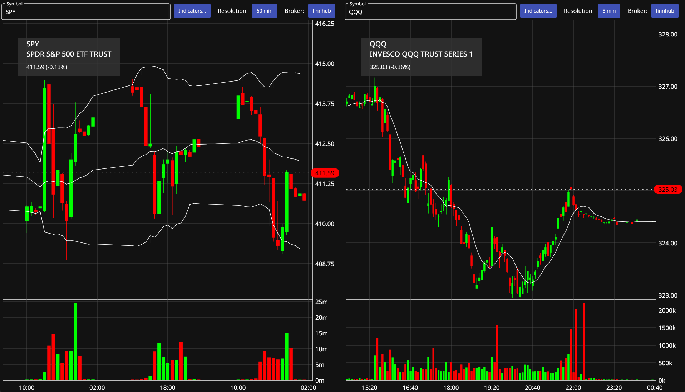

# maystocks

Stock Market Data Analysis Software

Note: THIS IS A PRE-ALPHA release!

### How to use

You need a finnhub or alpaca account (or both) to retrieve stock market data. Note: finnhub candle data is no longer
available for free.

Enter key/secret during setup, they will be encrypted using a password and stored locally (in %APPDATA%/maystocks on Windows,
$HOME/Library/Application Support/maystocks on Mac).

Currently, only US market data is supported. Trading is not supported (links to trading sites are shown for some brokers).

Left click to scroll/zoom. Right click to reopen settings after initial setup.

## Q & A

### How about more indicators?

More indicators will be added eventually.

### Does maystocks also support crypto data?

Not yet, but I plan to add support. Please bear with me - any kind of encouragement is welcome :-)

### Could you please add support for a specific broker/api provider?

Please suggest additional brokers on the community discord.

### Community

[Discord](https://discord.gg/AyXVpnZhv6)

### License

AGPL3

Copyright (c) Lothar May